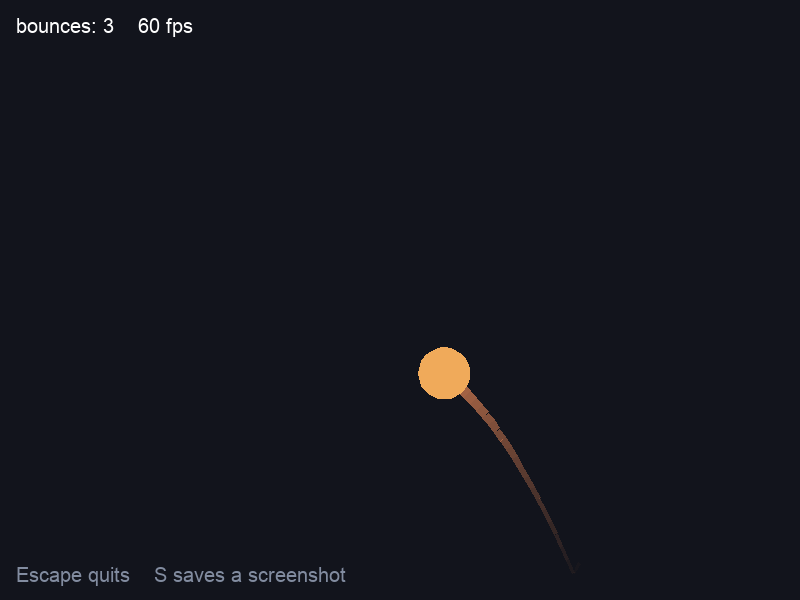

# sdl3-demo

Four packages in one program — a window, a bouncing ball, text, a note on every bounce, and a
screenshot — and no asset file anywhere.



That picture is the program's own output: `sdl3-demo --shot demo.png` runs the whole thing with no
display and no sound card and writes what it drew.

## Running it

```
brew install sdl3 sdl3_ttf sdl3_image sdl3_mixer
sysl run . --include-path /opt/homebrew/include --link-path /opt/homebrew/lib
```

Both flags are needed and neither can live in `package.hocon` — `design/15 §8` refuses a field for a
library prefix, because where Homebrew put itself is a fact about a laptop rather than a property of
a package. `CPATH` and `LIBRARY_PATH` do the same job if the setting never changes on your machine.

**Escape** quits, and **S** writes `screenshot.png` beside the program.

## What it is showing

| package | what the demo does with it |
|---|---|
| [`sdl3`](https://github.com/sysl-lang/sdl3) | the window, the renderer, the event queue, and the clock the frame loop is stepped by |
| [`sdl3-ttf`](https://github.com/sysl-lang/sdl3-ttf) | the two lines of text, rendered from a font the machine already has |
| [`sdl3-image`](https://github.com/sysl-lang/sdl3-image) | the screenshot — used as an *encoder*, which is the half of it a demo usually skips |
| [`sdl3-mixer`](https://github.com/sysl-lang/sdl3-mixer) | a note on each bounce, pitched by where the ball hit |

**They are four packages rather than one because a link directive is never pruned.** Every unit of a
compilation contributes its libraries whether the program reaches them or not, so a single package
holding all four would put `-lSDL3_ttf -lSDL3_image -lSDL3_mixer` on the link line of a program that
only draws rectangles — and a machine with just SDL3 installed could not build it. A program that
wants all four says so, which is what this one's `dependencies` block is.

## No asset file

Nothing is read from disk that the program did not find or make. A demo shipping a font, a picture
and a sound would be demonstrating that git still holds three files, and would stop working the
first time one was moved.

- **The font** is one the machine already has — the program tries the usual places on macOS and on
  the common Linux layouts, and says so plainly if none of them is there rather than failing later
  on a null handle.
- **The sound** is `MIX_CreateSineWaveAudio`, a tone SDL_mixer generates. There are five of them, on
  five voices, so two bounces close together overlap instead of cutting each other off.
- **The picture** is the one the program writes.

## The parts worth reading

**The step is measured, not assumed.** `ticks_ns()` says how long the last frame took and the
physics is advanced by that, so the ball falls at the same rate on any machine. The step is clamped,
because dragging a window stops the loop for as long as the mouse is held and an unclamped step then
teleports the ball through a wall.

**The status line is rebuilt only when what it says changes.** Rendering a string is a glyph raster
and a texture upload; doing it sixty times a second to draw the same two numbers is the mistake this
binding makes easy. The numbers the texture was last built from are kept beside it.

**The screenshot is read before `present`, not after.** Presenting is allowed to leave the
backbuffer undefined, so a shot taken afterwards is a bet on the driver.

**`--shot <path>` is what makes a demo checkable.** It sets SDL's dummy video and audio drivers,
hides the window, runs 150 frames of a fixed sixtieth-of-a-second step and saves the result — so
every line of the program still runs, on a machine with no display, and the picture is the same
every time. That is why the image at the top of this page is evidence rather than decoration.

## License

ISC — see [LICENSE](LICENSE).
